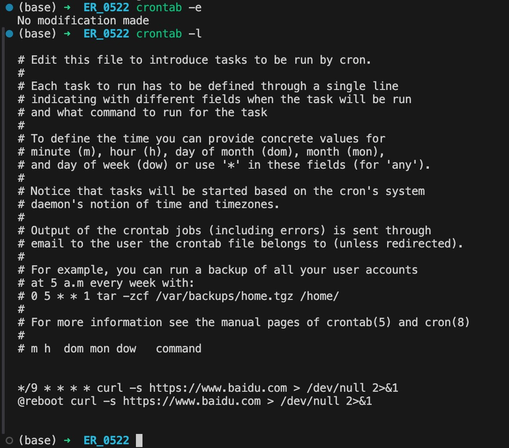
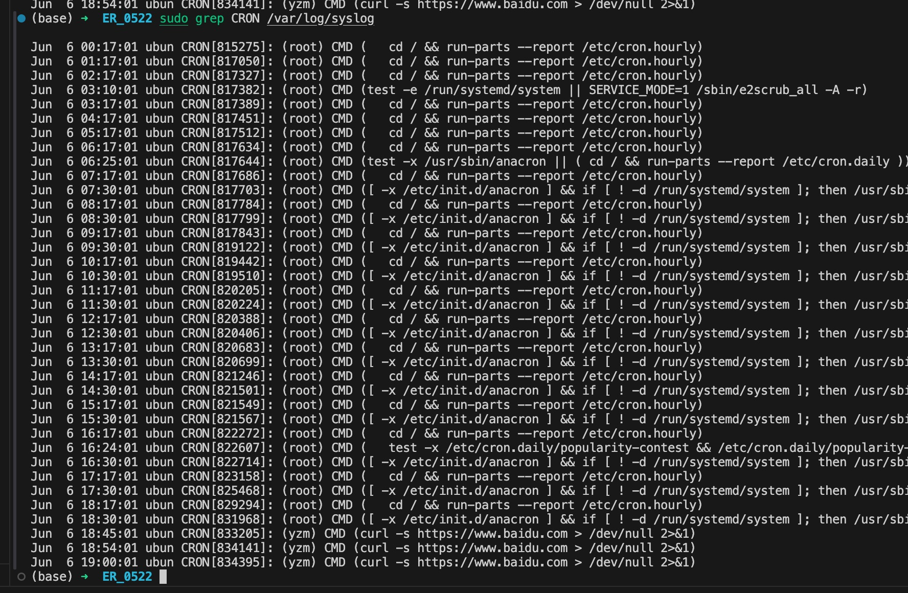

- [ubuntu](#ubuntu)
  - [server 后台运行间隔一定时间走点流量的脚本（防止bit校园网掉线）](#server-后台运行间隔一定时间走点流量的脚本防止bit校园网掉线)
- [如何将本地的文件夹新建为 github 仓库](#如何将本地的文件夹新建为-github-仓库)


# ubuntu
## server 后台运行间隔一定时间走点流量的脚本（防止bit校园网掉线）

cron：<br> 
这是一个基于时间的作业调度程序，用于在指定时间或周期性地执行任务。<br>

以下是如何在Ubuntu Server上使用 cron 后台运行一个脚本的步骤：

1. 编辑 crontab 文件
首先，打开 crontab 编辑器：
```sh
crontab -e
```
如果是第一次运行这条命令，系统可能会让你选择一个文本编辑器。选择你熟悉的编辑器。

2. 添加一个新任务
在 crontab 文件中添加一行，以指定何时和如何运行你的脚本。cron 格式如下：
```plaintext
*/9 * * * * curl -s https://www.baidu.com > /dev/null 2>&1
@reboot curl -s https://www.baidu.com > /dev/null 2>&1
```
以上代码表示每隔9分钟下载 https://www.baidu.com 页面，且不用保存任何结果和报错。因为我们的目的仅仅是希望走下流量。<br>
第二行是说每次重启都立即运行一次。<br>
保存并退出编辑器，cron 任务就会被自动安装并定时运行。<br>
<!-- { width=300 } -->

<div style="text-align: center;">
  
</div>


百度首页的下载流量取决于页面内容的大小，这会随时间变化而有所不同。一般来说，下载百度首页(HTML 文件)所消耗的流量大约在几十KB到几百KB之间。<br>
以下是 gpt 给出的看一下下载 https://www.baidu.com 页面的流量大小。
```
curl -s -w"%{size download}\n" https://www.baidu.com -o /dev/null 2>&1
```
并且 gpt 运行了一下，表示：下载百度首页消耗了 12345 字节(约 12KB)的流量。<br>
按 13k 计算：<br>
每个月约：24 * 60 * 30 = 43200 min <br>
每个月共运行约：43200 / 9 = 4800.0 次 <br>
消耗约：4800 * 13KB = 62400KB = 60.94MB = 约 61MB <br>

1. 其他命令
 - 查看和管理 cron 任务 <br>
你可以使用以下命令查看当前用户的 cron 任务：
```sh
crontab -l
```
- 查看是否成功在后台运行<br>
```sh
sudo grep CRON/var/log/syslog
```

<div style="text-align: center;">
  
</div>


# 如何将本地的文件夹新建为 github 仓库

- step 1. 在GitHub上创建一个新仓库；
- step 2. 

在本地目录下进行以下步骤。 
```sh
git init  # 初始化Git仓库
git add .  # 添加所有文件到暂存区
git commit -m "Initial commit"  # 提交所有文件
git remote add origin https://github.com/yourusername/yourrepository.git  # 将本地仓库连接到GitHub仓库
git push -u origin main # 推送本地仓库到 GitHub。推送到GitHub的 main/master 分支
```
如果是第一次推送到GitHub，你可能需要输入GitHub账户的用户名和密码或使用访问令牌（token）进行身份验证。
确保你的Git已经配置了用户名和电子邮件地址：
```sh
git config --global user.name "Your Name"
git config --global user.email "your.email@example.com"
```
- 其它
如果要新添一个文件类型到 .gitignore 中的话，不是简单的添加，之前已经 push 到 github 上的文件不能删除，需查一下。


